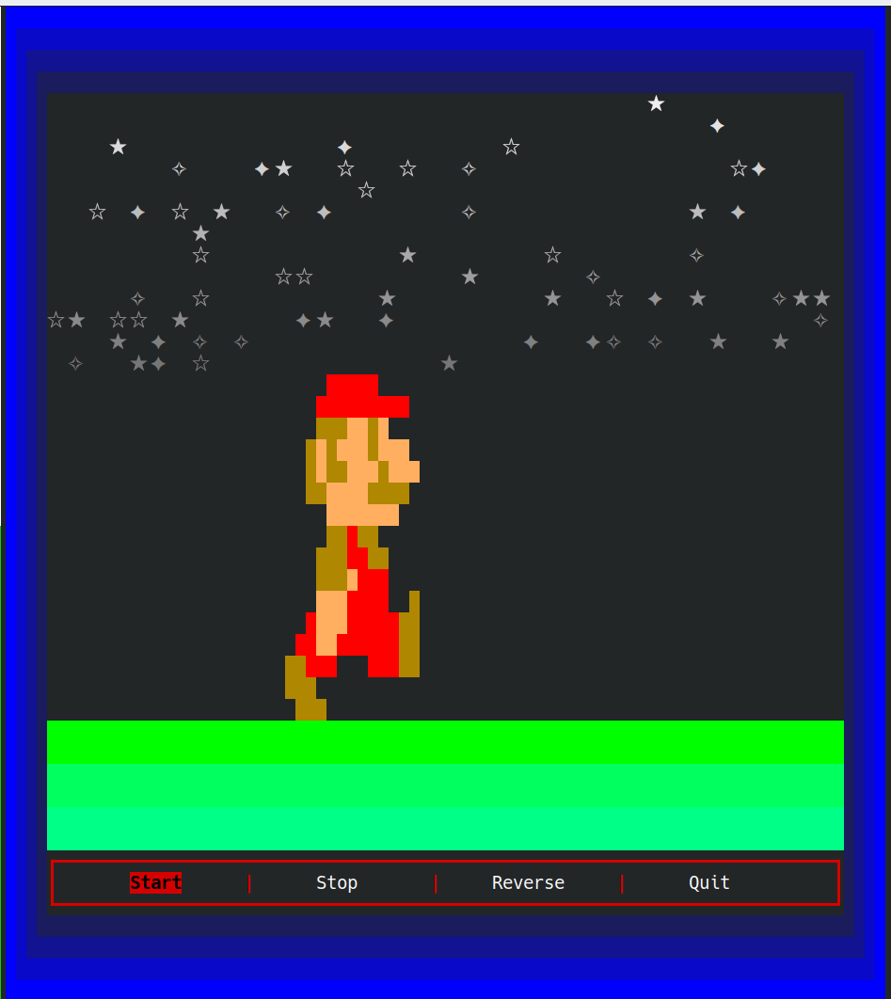

# Description
Animated Mario sprite rendered on the terminal with ncurses.

# How to build & run
First build & install ncurses-utils:

```terminal
$ cd ../ncurses-utils
$ make -j
$ sudo make install
```

Then build the current repo:

```terminal
$ make -j
$ ./build/main
```

# Screenshot


# Sprite
Mario: [mariouniverse.com][mario]

[mario]: https://www.mariouniverse.com/wp-content/img/sprites/nes/smb/mario-custom.png
