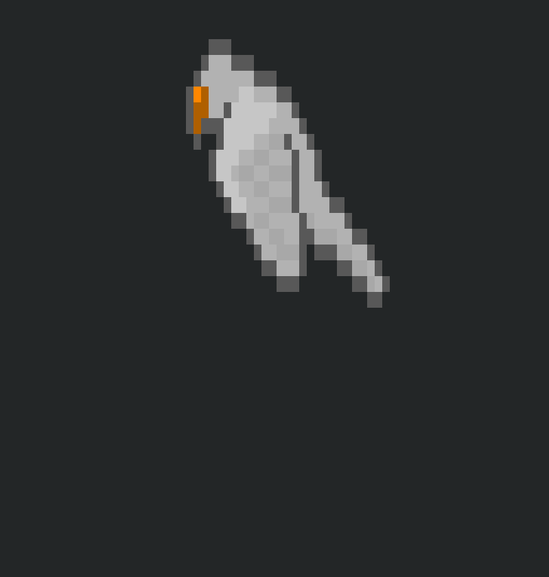

# Description
Animated bird (4 frames) rendered on the terminal with ncurses.

# How to build & run
First build & install stb-utils:

```terminal
$ cd ../stb-utils
$ make -j
$ sudo make install
```

Then, build & install ncurses-utils:

```terminal
$ cd ../ncurses-utils
$ make -j
$ sudo make install
```

Then build the current repo:

```terminal
$ make -j
$ ./build/main images/bird/*.png
$ ./build/main images/flame/*.png
```

# Prerequisites
- ncursesw (ncurses with wide-character support to render UTF8 characters).
- Same [palette][palette] (256 colors) used by `<ncurses-dir>/test/picsmap.c` can be installed to `/usr/share/ncurses-examples/xterm-256color.dat` using:
```terminal
$ sudo apt install ncurses-example
```

[palette]: https://manpages.debian.org/bullseye/xterm/xterm.1.en.html#color0

# Screenshot



# Assets
- [Bird][bird]: 32x32px.
- [Flame][flame]: 32x32px

[bird]: https://opengameart.org/content/animated-birds-32x32
[flame]: https://bdragon1727.itch.io/free-effect-bullet-impact-explosion-32x32

# Inspiration
Download the source code for ncurses examples (look for this example: `<ncurses-dir>/test/picsmap.c`):
```terminal
$ apt-get source ncurses
```

# Rationale
- Export RGB frames images from gimp in `png` format (read with `stb-image`) & without transparency channel.
- Euclidean distance used to determine the closest palette color, the same way as in the function `map_color()` in `<ncurses-dir>/test/picsmap.c`.
